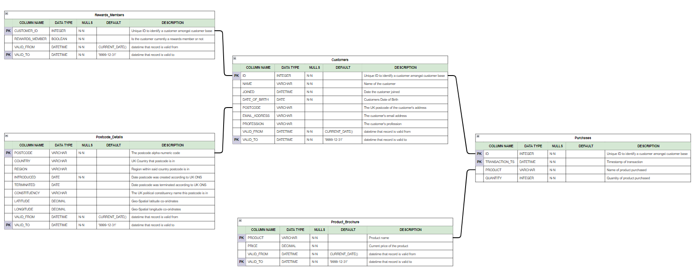

# Data Modelling with DBT (Data Build Tool)

So, with the RAW data pushed into Snowflake, now is the the time to build our Data Model, which can be done with DBT.<br>

DBT (core) is a useful open-source tool that allows us to create data models, through SQL, Jinja templating and other useful features. It's compatible with a variety of cloud & self-hosted database providers, such as Snowflake that we are using.

## Setting up our DBT project

We can use the initiation command to create a project. So, we move to our directory that the DBT project should be developed in, and then execute the initiation command

Now, in the this subdirectory `dbt_profile`, note there is a `profiles.yml` file existing already, with connection details for snowflake within it.<br>
This includes the use of Jinja templating to access confidential information from environment variables!<br>

We can use this pre-existing profile config when initiating DBT<br>

```
cd ./application/local_development/src/retail_modelling 

dbt init --profiles-dir ./dbt_profile 
```

You will be asked to name your project! You can also set-up a profiles.yml file here through the command line steps if you do not have a pre-existing one!

Once the project is named and created, you should see many sub-folders in your directory (project name) now created for you!

Now, the important part is this ... you will have a file within this DBT project called: `dbt_project.yml`. It is within this file, you need to ensure that the configiuration for ***profile*** is set to the profile you wish to use, as based on the `profiles.yml` file spoke about earlier. 

In this project, we are using the `customer-purchases` profile. Note, it's target it set to **prod**. So, when multiple connections exist under that profile, you will use the one the target is set to by default. 

Once that is chosen and set, you can test the connection!

**Quick Note**

> advice here would be to explicitly set the path to your profiles.yml file through an environment variable, so DBT can know exactly where to look for the profiles when collecting connection info. You can do this by:

```
# set the profile path env variable for DBT 
export DBT_PROFILES_DIR=<your_path_to_profiles_dir>
```


#### Testing DBT connection to your database!

To test your connection, as specified in your profiles.yml, execute:

```
# within your DBT project root dir
dbt debug --connection
```

You should get the green message saying all checks have passed if your connection was a success! 

---------

## Creating your `sources` within the DBT project

As part of our application, we have already built the lightweight ETL to source RAW data into snowflake. Now, we wish to create our sources as pointing to that RAW schema, so that we can make use of DBT lineage & referencing!

Within the `models/` subdir, create another sub-dir called **raw** and within that create a `sources.yml` file

```
# actions
cd models
mkdir raw 
cd raw
touch sources.yml 
```

If you look inside the file in the github repo, you'll now see that we have configured our RAW data as sources!


## Creating the clean data model

For this project, we will be implementing an SCD Type II style analytical database. In the format of star schema, we will be able to hold historical information on customers & transactions, that can later be used for analysis or reporting.

To implement this within DBT, we make use of `Snapshots`. This is DBTs way of creating SCD Type II models, and is a super useful feature for handling the UPSERT checks required on new source data, against existing data in the model, then changing the valid from & to datetime records as required.

We will also have DBT models in thsi section, some simple views (not materialized) which overlay the snapshot tables, performing some clean up on columns before the end user can query tables, or our analytical schema (to come later) makes use of the data!

#### First, our Data Model for the schema: `PURCHASE_DATA`




The data model above will be build via DBT snapshots into the snowflake Purchase_Data schema.

So, how do we create snapshots in DBT?


#### Custom Schema use in DBT

By Default, DBT can target all models at one schema (the one specified within the profile being used)<br>

There is set behaviour where, if specifying a custom schema in a config block, it actually appends that name to tha target name, like:

```
target_name_custom_name
```

rather than just:

```
custom_name
```

So, whilst using this with caution!!! as it can lead to multiple dev's overwriting each others work if using same schema names etc. you can change this default behaviour by modifying the a custom macro to get the custom schema name.

In the `macros` folder, I create a sub-dir called `utils` and within this, an SQL file called:

***get_custom_schema***

In this file, paste:

```


   
   

       {{ default_schema }}

   

       {{ custom_schema_name | trim }}

   


```

Now, you will have the ability that when you specify a schema in the model config block within a model file, it will use that specific schema. This means one DBT project can now write and target multiple schemas where needed.