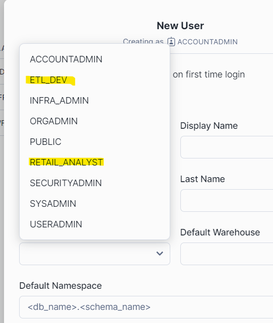

# Snowflake

In this example project, we will be using Terraform to manage Snowflake infrastructure, however, below is some guidance on setting up SnowSQL CLI client, so that you can interact with your snowflake resources from your machine, without logging into the console.

Terraform infrastructure guidance will be further down the notes.

### Setup SnowCLI

Assuming you already have a snowflake account, and login credentials, let's get started!

check that you have at least Python 3.8 installed on your machine. If not, install it.

```
python --version
```

I have 3.11.7 installed on my dev machine

Next, use PIP to install the Snowflake SQL CLI package

```
pip install snowflake-cli-labs

# verify it's installation with a quick test 
snow --help
``` 

If that test command returns guidance, then you have successfully installed it to your machine!

With the package installed, you should now create a configuration file on your system that snowflake can look to, in order to establish a connection

Navigate to your home folder `~`. Create a new directory called `.snowflake`. Inside of that directory, create a new file called `config.toml`. This is where the credentials for connection will be stored.

```
cd ~
mkdir .snowflake

cd .snowflake
touch config.toml 
ls -a
```

And you should see your empty, `config.toml` file there.

You can use a text editor for linux, like **vi** ot **nano** to edit this file.

```
nano config.toml
```

Inside this file, you will want to have the following:

```
default_connection_name = "infra_service"

[connections.infra_service]
account = "your_account_identifier"
user = "sf_infra_srv_user"
password = "the_password"
warehouse = "compute_wh"
database = "SNOWFLAKE"
schema = "INFORMATION_SCHEMA"
```

This will specify a connection profile (you can have multiple in this config file) and it will specify the default connection the CLI package should use when you don't specify an individual profile as a command line argument at connection.

You can then use ***ctrl+o*** to save the file, and ***ctrl+x*** to exit back to the command line.

You will also need to edit permissions on this file, so that the fille is not fully exposed to anyone. Use:

```
chmod 0600 config.toml
```

With this done, let's run a quick connection test!

In your terminal, execute:

```
snow connection test --connection="infra_service"
```
You should get a message back to the terminal with details indicating the connection was successful!

You can also run a quick test of actually connecting via the default profile we set, and running an SQL statement

```
snow sql -q "select 'hello world' as starter;"
```

This will then execute the query (the `-q` option) and return a result with hello world!

You can actually also log into snowflake, and view this query on your warehosue query history

Now, you are all set for any Snowflake command line activity, and know that you have working credentials for a remote connection from your machine!

-------------------------------------------

## Terraform Infrastructure

So, inside this snowflake subdirectory we have the terraform code for the infrastructure.

Firstly, we have the `.\modules` subdir, which contains reuasble code that we can call within our actual infra to provision snowflake resources. It helps for modularity of code and creating building blocks, tidier code etc. 

We also have a `.\prod` subdir, designed to mimic if we had something like a:

* dev
* test
* prod

setup on snowflake for our resources etc.

Inside the `.\prod` subdir, we have two separate folders. One for creating roles, one for creating objects, like warehouses, databases, schemas etc. We create the roles first (more below) because their is a dependancy on them then being used in the infra build to assign certain permissions.

### Formatting

So, first and foremost, from within the `.\snowflake` subdir, we can run the following code which will use the terraform formatter to clean all our files and lint them to ensure stylistic best practice

```
cd snowflake

# run the lint - use recursive option to ensure all subdirs from current dir get actioned as well
terraform fmt -recursive
```

This will then present a list of all the files that have been modified (tidied).

### Snowflake Roles

Now, change into the `.\prod\roles` subdir. From within here, we will create some role on Snowflake through our terraform code.<br>
Start by running `terraform init`. This will initialise all the terraform code and catch any immediate erros, such as issues with collecting the required providers etc.<br>
Next, run `terraform validate` which can confirm all the configuration for our terraform code appears correct, and help catch an early bugs.<br>
Then, run `terraform plan`. This will now map out a plan of what needs to be built. You can specify an output option to save this down if needed.<br>
Finally, once those have all passed, execute `terraform apply` to actually build the configurations specified. You will be prompted to provide a **yes** into your terminal to confirm the go ahead and build.

```
cd prod\roles

# initialise terraform in the subdir
terraform init

# validate the configuration
terraform validate

# build the plan & check it
terraform plan 

# execute the plan & provide `yes` to the terminal when prompted 
terraform apply 
```

You should get the green success message back if all has gone well!

Now, if you log into Snowflake UI directly, you can check that these new roles actually exist. Once in the UI, go to ***ADMIN*** on the options pane. Select ***users & Roles***. Now, once here you can choose the blue `+User` button top right. In the advanced options toggle of the popup, scroll down to default role, and look in the drop-down list. You should see the two roles you have created above via terraform!



<br>

### Snowflake Objects

We have created a variety of snowflake objects at this point:

* hold1
* hold2
* hold3

Here are those objects

<holder for picture>

We have also assigned specific privileges to the roles above, against the created objects. <br>
We can explore those on each object.

... add more details here 
